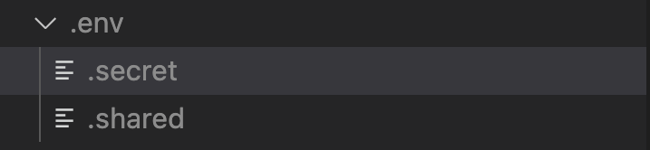

# Trading212_py Module

This is an unofficial Python client for the [Trading212 API](https://t212public-api-docs.redoc.ly/)
## Installation

You can install the package using pip:

```bash
pip install trading212py
```

## Configuration
### Environment Variables
Create a directory and call it .env
Create two separate files called .secret and .shared



#### Content of the .shared file
Add `ACCOUNT_TYPE` variable.

Options:
`ACCOUNT_TYPE="demo"` or `ACCOUNT_TYPE="live"`

#### Content of the .secret file
Add `T212_API_KEY` and `T212_DEMO_API_KEY` variables. 

Example: `T212_API_KEY='1234.....abcd'`

>Note: If the app is pushed to Production or running inside a docker container, then these variables will be overwitten with the existing environment variables. For that reason, add those KEYS in your platform's environments variables. 


## Usage

```
from trading212py.t212 import T212

def main():

    t212 = T212()
    print(t212.account_metadata())

if __name__ == '__main__':
    main()
```


# Disclaimer
Nor me or Trading212 are responsible for the use of this API, first make sure that everything works well through the use of a DEMO account, then switch to REAL mode.

In addition, I don't take responsibility for the accuracy of the information reported here and the proper functioning of the API

All trademarks, logos and brand names are the property of their respective owners. All company, product and service names used in this website are for identification purposes only.